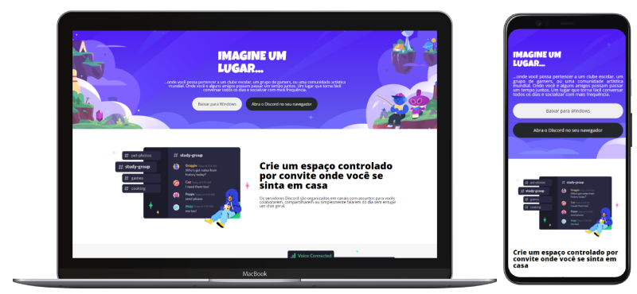

# Entrega de projeto - Construindo um Layout Responsivo Para o Site do Discord Com CSS | DIO
Neste desafio, você terá a oportunidade de aplicar os conceitos aprendidos até agora para reproduzir a página da plataforma incrível do Discord. O foco principal será na responsividade usando CSS.

### Tecnologias Utilizadas
- HTML
- CSS (com ênfase em Flexbox)
- CSS Resonsivo

### Para ver a página
[Link do projeto](https://fabiocasadossites.github.io/desafio-4-css-dio/)
